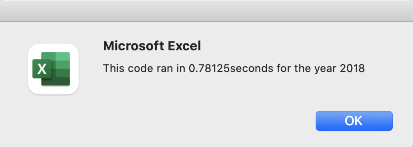

# Stock-analysis
Performing the analysis on the green energy stocks using Visual Basic for Applications to help Steve know the stock market trends for the years 2017 and 2018.
 

## Overview of the Project
This analysis aims to help steve analyze the green energy stocks as their parents are interested in investing in DAQO stock. Before investing their money, they want steve to check the performance of the stocks over a few years.
### Purpose
This challenge aims to refactor the original VBA code developed for all stocks analysis as the execution time was more. In order to proceed with the analysis, Steve wants to calculate the total daily volume and yearly return for each stock. Daily volume tells how actively a stock is traded and the total number of shares traded throughout the day. The yearly return is the percentage difference in price from the start to the end of the year.
## Results
### Running DQ Analysis
Using VBA, the code was initially developed to check the total volume and returns of the DQ stock. By seeing the return percentage, we can see a 200% increase in return in 2017, whereas in 2018, it was a 63% drop in return for DQ stock. So it will not be wise for steve to suggest his parents invest in DQ stock. In order to find a better option, he analyzed the multiple stocks.

### Running All the Stocks Analysis using Original code
In order to run the analysis on all the stocks, we need to create an array list for stocks named tickers; using nested for loops, we need to calculate the volumes and returns for each ticker. For the outer loop, we used the index of the ticker, and for the inner loop, we iterated from starting of the row to the last row of the worksheet, so for each ticker, the code has to run through the entire worksheet, which increases the run time of the code.

### Comparing 2017 and 2018 Stock Analysis Data
Based on the results of the analysis of the stocks categories, we can see that 2017 had successful returns as 11 out of 12 major stocks had positive returns, whereas in 2018, we can see only 2 out of the 12 stocks had positive returns. So more people would have profited in 2017. The below screenshots show the run time for both the years using the original code.

| 2017          | 2018          |
| ------------- | ------------- |   
||  |
||  |

### Running All the Stocks Analysis using refactor code
In the refactored code, we have used three output arrays: total volume, total starting price, and total ending price, and we have used tickerindex, which runs through the entire worksheet. We have used only one for loop to calculate the total volume and returns here, and we print the values in the worksheet using a separate for loop. So the code takes less memory, and it is more efficient.

| Original code         | Refactored code         |
| -------------         | -------------           |
| |   |
                        
The analysis results of the stocks using the original code and the refactored are the same, but the run time is reduced in the refactored code. We can say that the run time of the refactored is improved 5 times the original code.

| 2017          | 2018          |
| ------------- | ------------- |
|  |   |
|                          |  |

The values are color-coded using static and conditional formatting in this analysis. The green indicates the positive returns, whereas the red indicates the negative returns.

## Summary
### Advantages and Disadvantages of refactoring code in general
- Refactoring improves the existing code's design, performance efficiency, and reliability without adding extra functionality.
- It makes the code more readable and maintainable and reduces complexity.
- It makes runtime faster and is helpful when dealing with a large amount of data.
- The disadvantage of refactoring is some times the code may change the data, and it may introduce errors in the code.
- Sometimes it may be time-consuming if the code is not commented on and explained adequately.
### Advantages and disadvantages of the original and refactored VBA script
- In our VBA Script, the refactored code runs 5 times faster than the original, which improves the efficiency of the code.
- It avoids nested for loops, so we no need to switch back and forth the worksheet; it uses a single variable to access all the data from the worksheet and stores all the output data in arrays, which are printed separately.
- The original code worked well for fewer data sets, but it takes more time when we have a large dataset like thousands of stocks. So the refactored code works  more efficiently.
- There is no noticeable disadvantage of the refactored script. It takes some time to make the original script run correctly without errors, But it is worth it since we made an efficient code.

