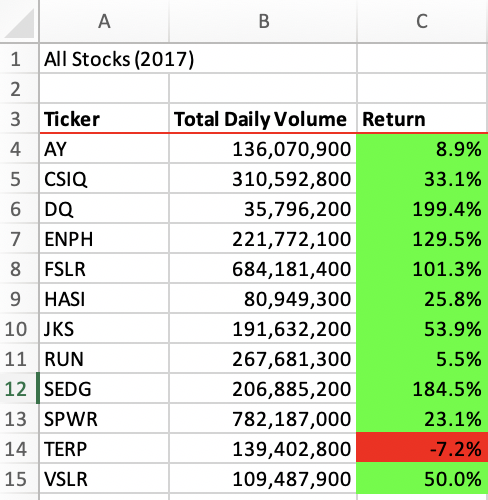

# Stock-analysis
Performing the analysis on the green energy stocks using Visual Basic for Applications to help Steve know the stock market trends for the years 2017 and 2018.
 

## Overview of the Project
This analysis aims to help steve analyze the green energy stocks as their parents are interested in investing in DAQ0 stock. Before investing their money, they want steve to check the performance of the stocks over a few years.
### Purpose
This challenge aims to refactor the original VBA code developed for all stocks analysis as the execution time was more.
In order to proceed with the analysis, Steve wants to calculate the total daily volume and yearly returns for each stock. Daily volume is the total number of shares traded throughout the day, and it measures how actively a stock is traded. If a stock is traded often, then the price will accurately reflect the value of the stock. The yearly return is the percentage difference in price from the beginning to the end of the year.

## Results
### Running DQ Analysis
Using VBA, the code was developed to check the total volume and returns of the DQ stock. By seeing the return percentage, we can see a 63% drop in 2018. So it will not be wise for steve to suggest his parents invest in DQ stock. To find a better option, he analyzed multiple stocks.

### Running All the Stocks Analysis using Original code:
In order to run the analysis on all the stocks, we need to create an array list for stocks named tickers; using nested for loops, we need to calculate the volumes and returns for each ticker. For the outer loop, we use the index of the ticker, and inner loop, we have a row count of the data, so for each ticker, the code has to run through the entire worksheet, which increases the run time of the code.

### Comparing 2017 and 2018 Stock Analysis Data
Based on the results of the analysis of the stocks categories we can see that 2017 has successful return as 11 out of 12 major stocks has positive returns where as in 2018 we can see only 2 out of the 12 stocks has positive returns.So more people would have been profited in 2017.The below screenshots shows the run time for both the years using original code.

| 2017          | 2018          |
| ------------- | ------------- |   
||  |
||  |

### Running All the Stocks Analysis using refactor code:
In the refactor code we have used three output arrays such as total volume,total starting price,total ending price and we have used tickerindex which runs through the entire worksheet.Here we have used only one for loop to calculate the total volume and returns.so the code takes less memory and it is more efficient.

| Original code         | Refactored code         |
| -------------         | -------------           |
| |   |
                        
The results of the analysis of the stocks using original code and the refactored are the same but the run time is reduced in the refactored code.
we can say that the run time is improved 5 times the original code.

| 2017          | 2018          |
| ------------- | ------------- |
|  |   |
|                          |  |

